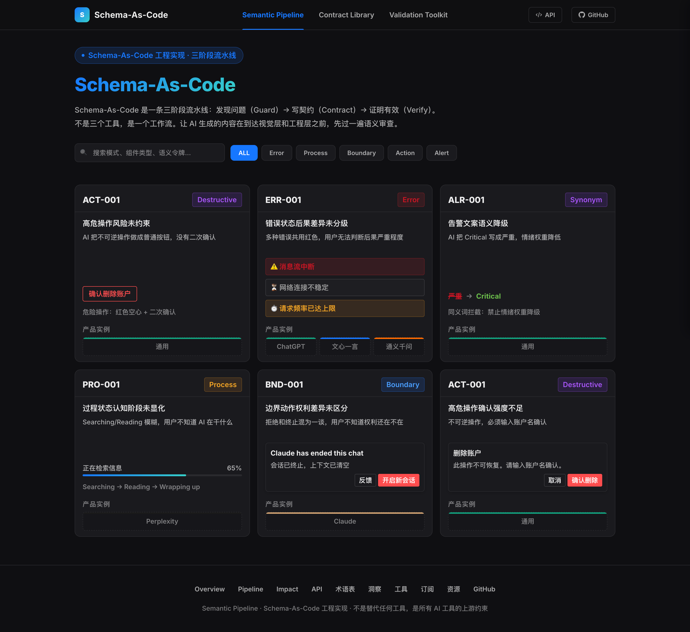

<!-- 标题 -->
<h1>Schema-As-Code</h1>

<strong>当 AI 生成界面时，设计意图在偏离。</strong>

<!-- 按钮行 -->

  
  
  
  
  

<!-- BANNER：点击跳转到在线页面 -->

---

## 一句话版

**Schema-As-Code 是一条三阶段流水线**：发现问题（Guard）→ 写契约（Contract）→ 证明有效（Verify）。让 AI 生成的内容在到达视觉层和工程层之前，先过一遍语义审查。

不是替代任何工具，是所有 AI 工具的上游约束层。

---

## 在线体验

👉 **[https://2436041978-ops.github.io/semantic-pipeline/](https://2436041978-ops.github.io/semantic-pipeline/)**

| 阶段 | 功能 | 入口 |
|------|------|------|
| 🔍 **Guard** | 发现语义断层：搜索模式、查看症状证据 | [模式库](https://2436041978-ops.github.io/semantic-pipeline/) |
| 📝 **Contract** | 写语义契约：YAML / Prompt 前缀 / Checklist | [契约库](https://2436041978-ops.github.io/semantic-pipeline/) |
| ✅ **Verify** | 跑验证工具：语义分级器 / JSON 输入 / 快照模板 | [验证工具集](https://2436041978-ops.github.io/semantic-pipeline/) |

---

---

## 已验证模式（6 个）

| 模式 ID | 组件类型 | 断层名称 | 典型症状 | 产品实例 |
|---------|---------|---------|---------|---------|
| **ERR-001** | 错误状态 | 后果差异未分级 | 多种错误共用红色，用户不知道多严重 | ChatGPT、文心一言、通义千问 |
| **PRO-001** | 过程状态 | 认知阶段未显化 | Searching/Reading 模糊，用户不知道 AI 在干什么 | Perplexity |
| **BND-001** | 边界动作 | 权利差异未区分 | 拒绝 vs 终止混为一谈，用户不知道权利还在不在 | Claude |
| **ACT-001** | 高危操作 | 风险未约束 | 删除按钮做成蓝色实心，没有二次确认 | 通用 |
| **ALR-001** | 告警文案 | 语义降级 | Critical 被写成"严重"，值班员延迟响应 | 通用 |
| **STP-001** | 状态提示 | 语义权重未对齐 | 重要通知做成弱提醒，普通通知做成强提醒 | 通用 |

---

## 契约示例

从 `examples/` 目录复制对应的 YAML 文件，放到你的项目中：

| 模式 | 适用场景 | 文件 |
|------|---------|------|
| ERR-001 | 错误状态分级 | [examples/err-001.yaml](examples/err-001.yaml) |
| PRO-001 | 过程状态显化 | [examples/pro-001.yaml](examples/pro-001.yaml) |
| BND-001 | 边界动作区分 | [examples/bnd-001.yaml](examples/bnd-001.yaml) |
| ACT-001 | 高危操作约束 | [examples/act-001.yaml](examples/act-001.yaml) |
| ALR-001 | 告警文案规范 | [examples/alr-001.yaml](examples/alr-001.yaml) |
| STP-001 | 状态提示权重 | [examples/stp-001.yaml](examples/stp-001.yaml) |

每个 YAML 文件包含：
- **语义令牌**：定义这个场景下必须表达什么语义
- **视觉映射**：颜色、图标、动画与语义级别的对应关系
- **用户行动**：每个语义级别应该提供什么操作按钮
- **LLM 约束**：AI 生成时绝对不能做什么、必须做什么
- **不可变边界**：违反就阻断的硬规则

---

## 组织经济学价值

| 指标 | 之前 | 之后 |
|------|------|------|
| 语义返工率 | 30% | **5%** |
| 规范同步时间 | 2 人周 | **0.5 天** |
| 走查覆盖率 | 20% | **100%** |

---

## 快速开始

**设计师（不会写代码）：**
1. 打开 [在线模式库](https://2436041978-ops.github.io/semantic-pipeline/)
2. 找到你遇到的组件类型（如"错误状态"）
3. 查看症状截图 → 复制 Checklist → 发给前端

**前端（会写代码）：**
1. 从契约库复制 Prompt 前缀
2. 贴在 Claude Code / Cursor 指令前面
3. AI 自动生成符合语义约束的代码

**DesignOps（管规范）：**
1. 把规范写成 YAML 放 Git 仓库
2. 变更自动同步到所有 AI 工具
3. 机器走查覆盖率 100%

---

## 技术栈

- **Schema-As-Code**：YAML 语义契约（Intent Contract）
- **四层检查引擎**：语法推演 → 语义推演 → 安全推演 → 美感推演
- **消费方**：DevUI HMC / v0 / Claude Code / DESIGN.md / Figma MCP

---

## 相关链接

- 📖 [语雀文档](https://www.yuque.com/u222739/lxcrw1)
- 🌐 [在线交互式总览](https://2436041978-ops.github.io/semantic-pipeline/)
- ⭐ [GitHub 仓库](https://github.com/2436041978-ops/semantic-pipeline)

---

  
Schema-As-Code · 不是替代任何工具，是所有 AI 工具的上游约束

